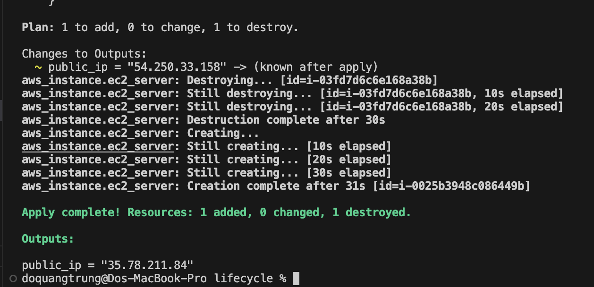
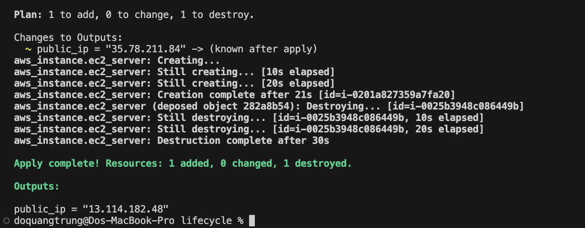
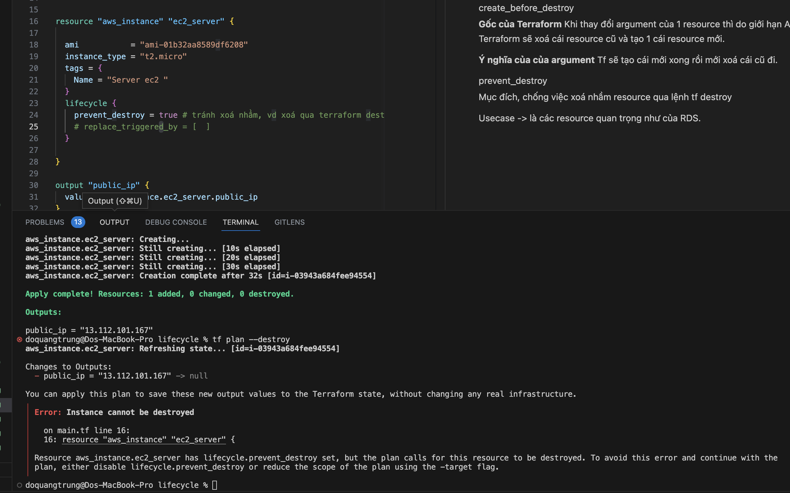
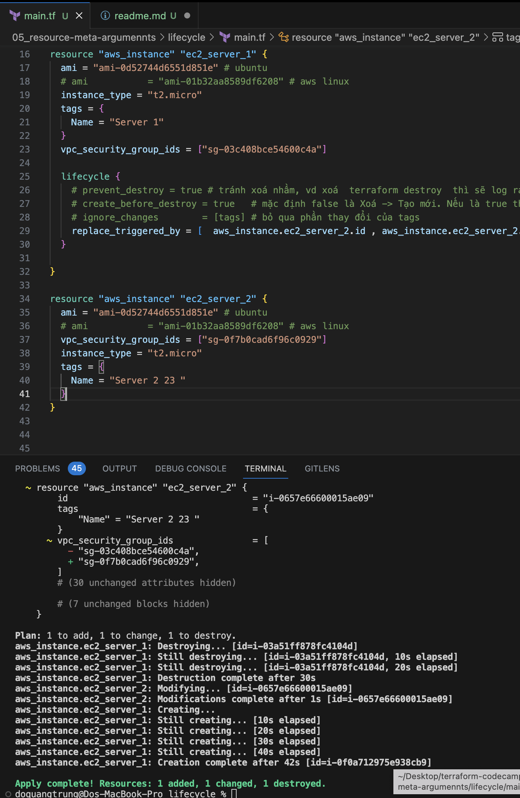

# Life cycle
https://developer.hashicorp.com/terraform/language/meta-arguments/lifecycle

Có 4 agrument của lifecycle
* create_before_destroy 
* prevent_destroy 
* replace_triggered_by 
* ignore_changes 

### Cụ thể 
#### create_before_destroy

__Gốc của Terraform__
Khi thay đổi argument của 1 resource, Có thể có những arg không thay đổi do giới hạn API. Terraform sẽ xoá cái resource cũ và tạo 1 cái resource mới.

 ( Một số arg ví dụ như tên thì có thể thay đổi luôn, còn như image thì không thể thay đổi luôn mà phải tạo cái mới. # aws_instance.ec2_server must be replaced )

__Ý nghĩa của của argument__
Tf sẽ tạo cái mới xong rồi mới xoá cái cũ đi.

trường hợp set create_before_destroy

#### prevent_destroy

Mục đích, chống việc xoá nhầm resource qua lệnh tf destroy   

Usecase -> là các resource quan trọng như của RDS.  

nếu detroy  sẽ gây ra lỗi vd như

#### ignore_changes

Bỏ qua sự thay đổi của thuộc tính nào đó khi update

Giả sử mà trên remote infra, thuộc tính đó bị update chay bằng tay thì, ở lần chạy tf tiếp theo, thuộc tính đó sẽ cập nhập lại vào trong file tfstate

#### replace_trigger_by

Resource A setting  replace_trigger_by, ánh xạ tới thuộc tính của resource B

Khi thuộc tính resource B thay đổi thì resource A sẽ bị replace.  

Ví dụ ec2_server_1 đang setting replace_trigger_by  id và sg của ec2_server_2

