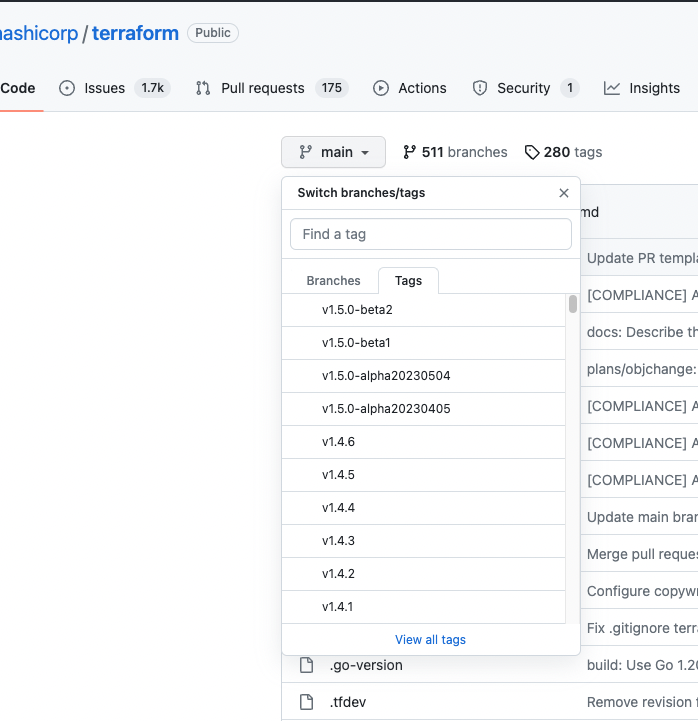

# Expression

Mở console

```bash
terraform console
```

### splat example


## For example


## If example


## Sematic version 

https://semver.org/lang/vi/


Có thể check version thông qua tag của github.
https://github.com/hashicorp/terraform

